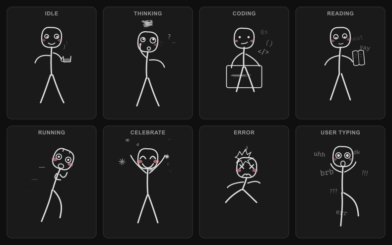

# Code Pet

A desktop pet that reacts to [Claude Code](https://docs.anthropic.com/en/docs/claude-code) in real time. A hand-drawn stick figure lives in a transparent always-on-top window and changes its animation based on what Claude is doing — thinking, writing code, reading files, running commands, and more.

[中文文档](./README.zh-CN.md)

<!-- TODO: Add demo GIF here -->
<!--  -->

## States

| State | Trigger | Animation |
|-------|---------|-----------|
| idle | Claude is idle / stopped | Dozing off, hand-drawn Zzz floating above |
| thinking | User sends a message | Tilts head, scratches head, `?` `!` floating |
| coding | Edit / Write tool | Furiously typing on keyboard, `</>` `{ }` `=>` floating |
| reading | Read / Glob / Grep tool | Holding a book, `wow` `aha` `cool` floating up |
| running | Bash tool | Running in place, sweat drops |
| celebrate | Task completed | Jumping with joy, sparkle stars + confetti |
| error | Tool execution failed | Shaking, looping explosion + smoke |
| user_typing | Terminal keyboard input detected | Catching falling characters, words pile up |

## How It Works

```
┌─────────────────┐     hook events      ┌──────────────────┐
│   Claude Code   │ ──────────────────>   │  Hook Script     │
└─────────────────┘                       └────────┬─────────┘
                                                   │ writes JSON
                                                   v
                                          ~/.claude-pet/status.json
                                                   ^
                                                   │ polls 500ms
┌─────────────────┐     Tauri events      ┌────────┴─────────┐
│   SVG Renderer  │ <──────────────────   │   Rust Backend   │
│  (renderer.js)  │                       │  (status.rs +    │
│  (decorations.js)                       │   keyboard.rs)   │
└─────────────────┘                       └──────────────────┘
```

Claude Code [hooks](https://docs.anthropic.com/en/docs/claude-code/hooks) fire shell commands on events like `PreToolUse`, `UserPromptSubmit`, etc. Our hook script writes the current state to a JSON file. The Tauri backend polls this file and pushes state changes to the SVG frontend, which renders the stick figure animation.

## Tech Stack

- **Tauri v2** — transparent borderless desktop window
- **SVG** — procedural hand-drawn vector animation, zero external assets
- **Claude Code Hooks** — event-driven state switching
- **Win32 API** — terminal keyboard input detection (Windows only)

## Prerequisites

- Windows 10/11 (macOS/Linux support planned)
- [Rust](https://rustup.rs/) + cargo
- [Tauri v2 CLI](https://v2.tauri.app/start/prerequisites/)
- [Claude Code](https://docs.anthropic.com/en/docs/claude-code)

## Install

**1. Build**

```bash
cd code-pet
cargo tauri dev      # development
cargo tauri build    # production
```

**2. Install hooks**

```powershell
powershell.exe -ExecutionPolicy Bypass -File scripts/install-hooks.ps1
```

**3. Restart Claude Code** — hooks take effect immediately.

### Uninstall hooks

```powershell
powershell.exe -ExecutionPolicy Bypass -File scripts/uninstall-hooks.ps1
```

## Interaction

- **Drag** — hold left mouse button to move the pet around
- **Click** — pet reacts (e.g., clicking during idle triggers celebrate)
- **Right-click menu** — Reset Position / Size (S/M/L) / Quit

## Debug

Open `src/debug.html` with any HTTP server to preview all animation states:

```bash
cd code-pet/src
python -m http.server 8080
# Open http://localhost:8080/debug.html
```

Manually trigger a state (no Claude Code needed):

```powershell
powershell.exe -ExecutionPolicy Bypass -File hooks/claude-pet-hook.ps1 thinking
```

## Project Structure

| File | Purpose |
|------|---------|
| `src/renderer.js` | SVG character renderer — 8 poses with head, eyes, mouth, body, limbs |
| `src/decorations.js` | Per-state particle effects (floating text, stars, smoke, etc.) |
| `src/app.js` | State machine, animation loop, drag, right-click menu, scaling |
| `src/style.css` | Transparent background + transitions |
| `src/debug.html` | Debug panel to preview all states simultaneously |
| `src-tauri/src/lib.rs` | Tauri app entry, window init, bottom-right positioning |
| `src-tauri/src/status.rs` | Polls `~/.claude-pet/status.json`, 30s idle fallback |
| `src-tauri/src/keyboard.rs` | Win32 keyboard detection with 2s debounce |
| `hooks/claude-pet-hook.ps1` | Receives state param, atomic JSON write |
| `scripts/install-hooks.ps1` | Registers hooks into `~/.claude/settings.json` |
| `scripts/uninstall-hooks.ps1` | Removes hook registration |

## License

[MIT](./LICENSE)
